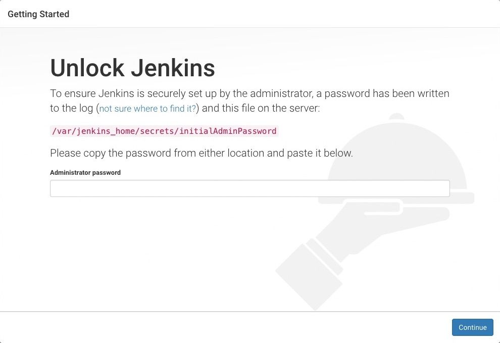

## Manual Installation On RHEL
###  Prerequisites

- Minimum hardware requirements:
	- 256 MB of RAM
	- 1 GB of drive space (although 10 GB is a recommended minimum if running Jenkins as a Docker container)
- Recommended hardware configuration for a small team:
	- 4 GB+ of RAM
	- 50 GB+ of drive space
###  Long Term Support release

- Install Supporting packages
```
sudo su - 
yum install wget tree -y
```
-  Setup the Jenkins stable Repository 
```
sudo wget -O /etc/yum.repos.d/jenkins.repo https://pkg.jenkins.io/redhat-stable/jenkins.repo
```
```
sudo rpm --import https://pkg.jenkins.io/redhat-stable/jenkins.io-2023.key
sudo yum upgrade
```
- Install JDK 
```
sudo yum upgrade -y 
```
```
sudo yum install fontconfig java-17-openjdk -y
```
- Install Jenkins and reload demon
```
sudo yum install jenkins -y
```
```
sudo systemctl daemon-reload
```
### Start Jenkins

1. You can enable the Jenkins service to start at boot with the command
```
sudo systemctl enable jenkins
```
2. You can start the Jenkins service with the command
```
sudo systemctl start jenkins
```
3. You can check the status of the Jenkins service using the command
```
sudo systemctl status jenkins --no-pager
```

---
## Installation Using Shell Script

##### Method 1

1. Create new file named as `jenkins.sh`
```
touch jenkins.sh
```
2. Add the below code in jenkins.sh file
```
vi jenkins.sh 
```
```
#/bin/bash
#Author: Sankeerth Chillamcharla
#Orgination: OpsfusionLabs

  
sudo yum install wget tree -y
sudo wget -O /etc/yum.repos.d/jenkins.repo https://pkg.jenkins.io/redhat-stable/jenkins.repo
sudo rpm --import https://pkg.jenkins.io/redhat-stable/jenkins.io-2023.key
sudo yum upgrade -y
sudo yum install fontconfig java-17-openjdk -y
sudo yum install jenkins -y
sudo systemctl daemon-reload
sudo systemctl enable jenkins
sudo systemctl start jenkins
sudo systemctl status jenkins --no-pager
```
```
:wq!
```
3. Change the file permission to make as a executable file
```
chmod +x jenkins.sh
```
5. Run Shell Script
```
sh jenkins.sh 
```
   
##### Method 2
1. Clone git repo 
2. Change the file permission to make as a executable file
3. Run Shell Script
##  Post-installation setup wizard

- Browse to `http://localhost:8080` (or whichever port you configured for Jenkins when installing it) and wait until the **Unlock Jenkins** page appears.



- The command: `sudo cat /var/lib/jenkins/secrets/initialAdminPassword` will print the password at console.

- **Install suggested plugins** - to install the recommended set of plugins, which are based on most common use cases.

- When the **Create First Admin User** page appears, specify the details for your administrator user in the respective fields and click **Save and Finish**.


